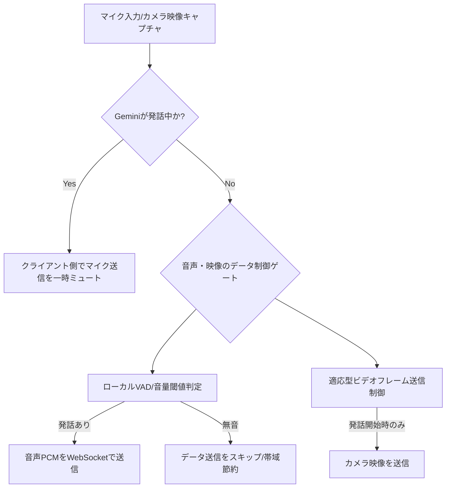

# Gemini Live データコントロール＆双方向対話最適化設計書

スマートグラスのエッジゲートウェイにおいて、アクション開始後に音声や映像データを無条件に送信し続ける（垂れ流す）と、以下の課題が発生し、快適な双方向対話が成立しません。

1. **不要な割り込み（Barge-in）の発生**:
   * 周囲の環境雑音、咳払い、またはスピーカーから出力されたGeminiの応答音声がマイクへ回り込む（エコー）ことにより、Geminiが「ユーザーが発話して割り込んできた」と誤判定し、応答を途中で停止（中断）してしまう。
2. **通信帯域とトークン（課金）の浪費**:
   * 無音時や静止状態でも、16kHz PCM音声および1 FPSの映像フレームを送信し続けると、アップロード帯域およびセッションコンテキストの入力トークンを急激に消費する。

これらの課題を解決し、快適なターン制・双方向対話を実現するための**最適なデータコントロール設計**を以下に提案します。

---

## 1. 最適なデータコントロール・3つのコア戦略



### 戦略 A: アシスタント発話中のマイク自動ミュート（ローカル・ハーフデュプレックス制御）

*   **設計内容**:
    *   GCPバックエンド（Gemini Live API）から音声パケットを受信し、iOSアプリのスピーカーで音声を再生している間、**クライアント側でマイク音声のWebSocket送信を一時的に「ミュート（パケット破棄）」**します。
    *   Geminiの応答再生が完了したことを検知（再生バッファが空になる、または応答パケットが一定時間途切れる）したタイミングで、自動的にマイクのミュートを解除（アンミュート）します。
*   **効果**:
    *   スマートグラスのスピーカーからマイクへのエコーバックや、応答中の環境雑音による「不要な割り込み（音声のぶつ切り）」を100%防止します。

### 戦略 B: クライアント側での簡易音声活動検知（ローカルVAD）

*   **設計内容**:
    *   iOSアプリ内でマイクのPCMバッファの二乗平均平方根（RMS）を計算し、音量（デシベル値）を簡易判定します。
    *   判定レベルが一定の閾値（例: -45dB〜-50dB）を下回る「無音状態」の場合、**WebSocket経由の音声パケット送信をスキップ（または送信レートを落としてキープアライブのみ）**します。
    *   発話を検知した瞬間からパケットの連続送信を開始します。
*   **効果**:
    *   無音時の余分なネットワークアップロード通信量を削減します。

### 戦略 C: 適応型（アクティビティ連動）ビデオフレーム送信

*   **設計内容**:
    *   常時1 FPSで映像フレームを送信し続けるのではなく、**音声発話のタイミングと連動して送信**します。
    *   **送信ルール**:
        1.  **発話開始時（トリガー）**: ユーザーが話し始めた最初の瞬間に、その時のカメラフレーム（静止画）を1枚送信（Geminiに現在の視覚的文脈を与える）。
        2.  **発話継続中**: ユーザーが話し続けている間は、3秒に1回などの低頻度で映像を追従送信。
        3.  **無音（待機・応答中）**: 映像送信を完全に停止。
*   **効果**:
    *   映像データのアップロード通信量とGeminiの入力トークン消費量を**最大90%削減**しつつ、対話に必要な視覚情報は100%維持します。

---

## 2. 状態遷移フロー（データ送信制御）

エッジゲートウェイ内のステートマシンは、以下の3つのサブ状態（Sub-state）を遷移します。

```
[スタンバイ (Idle)]
       |  (アクション起動: 音量ボタン等)
       v
[ユーザー発話フェーズ (Listening)]
   - マイク: アンミュート (ローカルVAD閾値以上のみ送信)
   - カメラ: 発話開始時に1枚送信 + 数秒おきに低頻度送信
       |
       |  (Geminiが応答を開始: "audio" 受信)
       v
[アシスタント応答フェーズ (Responding)]
   - マイク: 自動ミュート (パケット送信を停止)
   - カメラ: 送信を完全停止
   - スピーカー: Geminiの応答音声を再生
       |
       |  (再生完了: バッファ終了)
       +----------------------------> [ユーザー発話フェーズ (Listening) へ戻る]
```

---

## 3. 実装ロードマップ

本プロジェクトへ上記データコントロールを適用するための変更ポイントです。

1.  **`GeminiLiveClient` 内でのミュート機構の追加**:
    *   `isMuted` フラグを設け、`playAudioChunk` の実行から再生完了までの間、`processMicrophoneBuffer` 内での `sendAudioChunk` をスキップするように制御する。
2.  **`audioPlayerNode` の再生状態監視**:
    *   オーディオ再生ノードが終了したことを検知するコールバックをフックし、`isMuted` を `false` に戻す。
3.  **簡易RMS（音量閾値）チェックの導入**:
    *   `processMicrophoneBuffer` 内でPCMデータのRMSを求め、一定値以下の場合はパケットを送信しないようにガードする。
