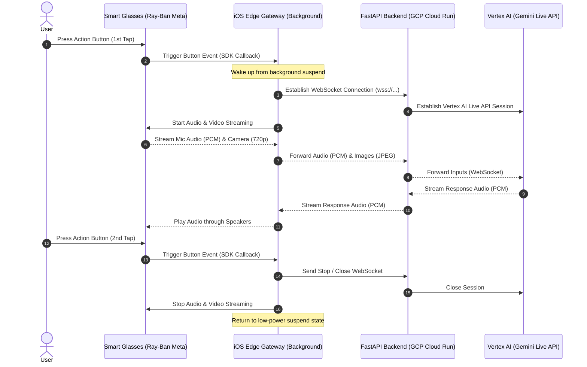

# Smart Glasses Triggered Gemini Live Gateway System Design

This document details the optimal system architecture and implementation plan for a "settings-only" iOS app that runs in the background and orchestrates Gemini Live API sessions based on physical action triggers from smart glasses.

---

## 1. System Architecture Diagram



---

## 2. Component Design

### A. iOS Client (Background Edge Gateway)
The iOS app functions primarily as a configuration and service controller. Once configured, it operates entirely headless in the background.

*   **Background Capabilities**:
    *   `Audio, AirPlay, and Picture in Picture`: Allows the `AVAudioEngine` input tap and audio player to function when the phone is locked or the app is in the background.
    *   `Uses Bluetooth LE accessories` & `Acts as a Bluetooth LE accessory`: Ensures persistent connection and event delivery from the Meta Wearables SDK.
*   **Session Controller (`GeminiLiveClient` / `GlassesConnector` Integration)**:
    *   Listens to button/gesture callbacks from the Meta Wearables SDK.
    *   Implements a **state toggle** on button events:
        *   **State 1: IDLE** $\rightarrow$ Press $\rightarrow$ Connect WebSocket, start recording/capturing, and stream to backend.
        *   **State 2: ACTIVE** $\rightarrow$ Press $\rightarrow$ Stop streaming, disconnect WebSocket, return to IDLE.
    *   **Timeout Override**: Disable the standard 15-second inactivity timeout (`hasStartedConversation` is no longer monitored for silence disconnects).

### B. Smart Glasses Event Listening (Meta SDK)
Depending on the specific Meta Wearables SDK (`MWDATCore` / `MWDATCamera`) version:
*   We subscribe to the button press state notifications.
*   If physical button interception is blocked by OS/hardware rules, we fallback to a developer gesture (e.g., specific head movement detected by IMU sensors) or custom trigger handled inside the Wearables SDK event stream.

### C. Backend (FastAPI on Cloud Run)
*   Remains stateless and serves as an authenticated secure proxy to Vertex AI.
*   Maintains the WebSocket connection for the duration of the active session.
*   **Request Timeout Configuration**: Configured to its maximum limit of **60 minutes (3,600 seconds)** to prevent early WebSocket connection terminations by the Cloud Run ingress proxy.
*   Supports rapid on-demand handshakes (using gRPC/WebSocket routing) to minimize latency from the first button press to active listening.

---

## 3. Key Technical Decisions & Rationales

| Decision Area | Selected Approach | Rationale |
| :--- | :--- | :--- |
| **Connection Lifecycle** | **On-Demand (On Button Press)** | Saves phone battery and GCP Cloud Run execution costs. Avoids keeping idle WebSockets open indefinitely. |
| **Background Mode** | **Background Audio + Bluetooth Accessory** | Prevents iOS from suspending the app when the phone is in the user's pocket. |
| **Termination Logic** | **Pure Button Toggle (Explicit)** | Gives the user absolute control over when the assistant is listening, avoiding accidental cutoffs during pauses in speech. |
| **User Feedback** | **System Beep Sound Cue** | Plays the system dictation start sound (1113) at start and dictation end sound (1114) at stop to notify the user of streaming state transitions. |
| **Security & Guardrails** | **Vertex AI Inline Model Armor** | Secures raw Gemini Live API WebSocket traffic against prompt injection, jailbreaking, and data leaks at the GCP infrastructure level without adding proxy code bloat. |

---

## 4. Xcode Configuration Requirements

To enable background execution, the `Info.plist` and Target Capabilities of the Xcode project must be configured as follows:

```xml
<key>UIBackgroundModes</key>
<array>
    <string>audio</string>
    <string>bluetooth-central</string>
    <string>bluetooth-peripheral</string>
</array>
```

---

## 5. Next Steps for Implementation

1.  **Xcode Settings**: Add target background capabilities to the `SmartGlassesGateway` project.
2.  **SDK Event Hooking**: Inspect `MWDATCore` device session interfaces to hook the specific button/action event.
3.  **UI Updates**: Refactor `AppView` to display connection profiles/settings only, removing manual toggle buttons and logs from the primary flow if needed (or keeping them in a collapsible "Developer Settings" section).
